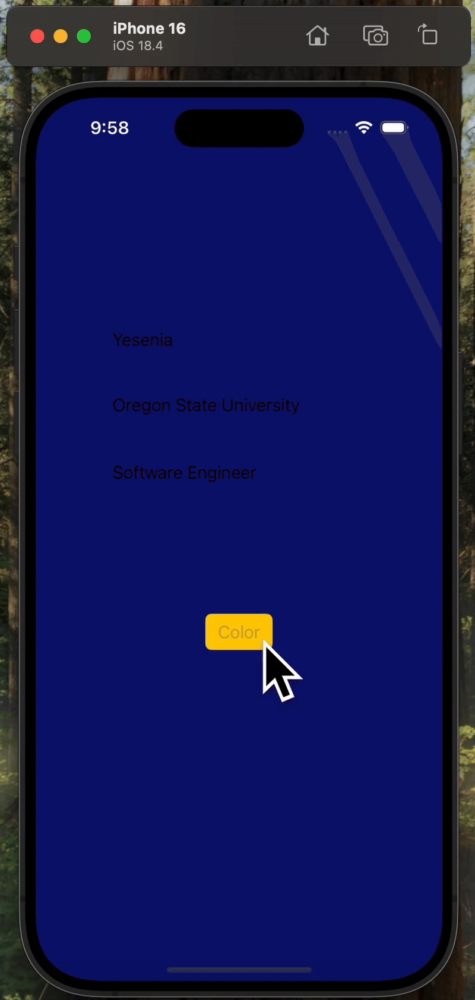

# Prework - Colorize

Submitted by: Yesenia Matamoros

Colorize is an app that allows users to change the main screen's background color via the click of a button. 

Time spent: 3 hours spent in total

## Required Features

The following **required** functionality is completed:

- [x] Users are see a screen with three labels and a button
- [x] Tapping the button changes the screen color to a random color
 
## Video Walkthrough

## App Brainstorming

Some of my current favorite applications and their features:

  Pinterest
  - Create shared boards with friends
  - Provides suggested boards for pins
  
  Natural Reader
  - Export audio files to mp3
  - Adjustable reading speed, volume, and voice type
  
  Goodnotes
  - Ability to sync audio with written notes
  - Can search written and typed text

App Idea

  An app I would like to build is Pokemon Study. The vision for this project is to create a study tool 
  which promotes focus and productivity for extended periods of time by gamifying the learning/studying 
  experience. The application will feature 2 modes for different forms of studying: Pomodoro and a digitized
  version of Leitner System. Users who accomplish studying tasks will be awarded with new Pokemon and/or evolution 
  of their current Pokemon. Thus, users will be able to track their study progress by checking in on their Pokemon 
  via a Pokedex which provides stats. 

## Challenges
The main challenge I faced was running the simulator, as my current MacBook didn't have enough RAM to handle it. 
I had to borrow another device with higher specifications to complete the task.

## License

    Copyright [2025] [Yesenia Matamoros]

    Licensed under the Apache License, Version 2.0 (the "License");
    you may not use this file except in compliance with the License.
    You may obtain a copy of the License at

        http://www.apache.org/licenses/LICENSE-2.0

    Unless required by applicable law or agreed to in writing, software
    distributed under the License is distributed on an "AS IS" BASIS,
    WITHOUT WARRANTIES OR CONDITIONS OF ANY KIND, either express or implied.
    See the License for the specific language governing permissions and
    limitations under the License.
